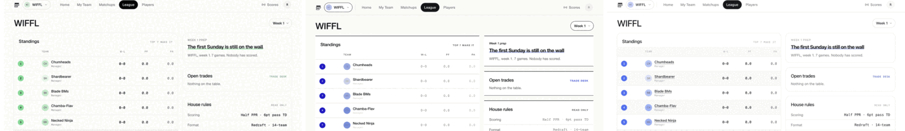
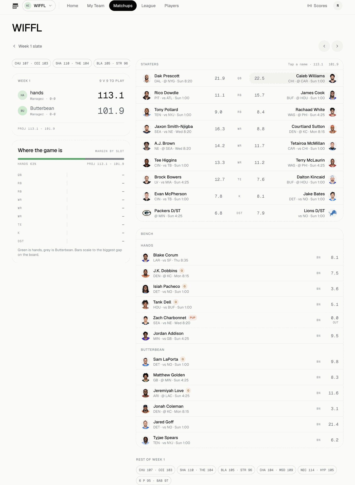
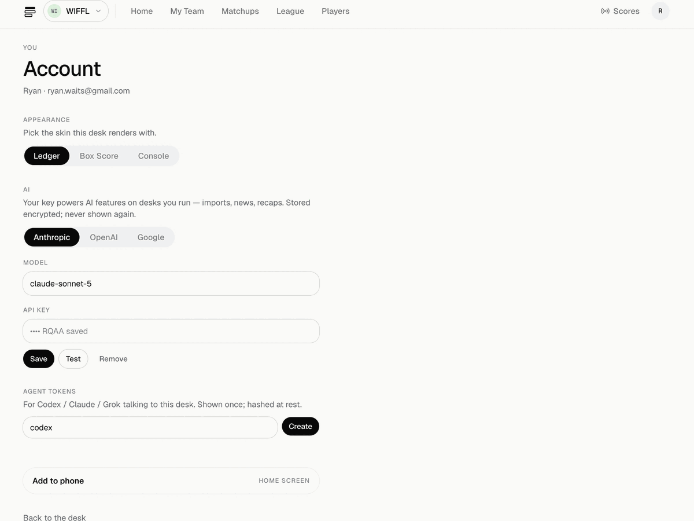

# open-leagues



**A headless fantasy football operator.** Postgres holds the league and
enforces the rules — conserved FAAB, one scoring book, no UI required.
Migrate a league in once from Sleeper, ESPN, or a pasted/PDF rebuild, and
from then on this is the source of truth. What runs on top isn't fixed:
the reference PWA above ships in three skins, and an MCP server exposes
the same league as callable primitives for Claude, Codex, or Grok —
57 of 76 documented verbs wired as of this writing:

```
context = getAgentContext(leagueId)        # seat, purse, standings, recent events
team    = getTeam(leagueId, context.rosterId, week)
# decide, using getProjections / getWire / getWeekProjections ...
sitPlayer(leagueId, benchedPlayerId)
startPlayer(leagueId, startingPlayerId)
```

Read your team, set your lineup, work the waiver wire, vote on a trade,
place a wager, migrate a league in — all without a browser. MIT licensed,
self-hosted, one deploy can host many leagues.

## Quickstart

```sh
git clone https://github.com/ryanwaits/open-leagues.git
cd open-leagues
docker compose up -d
```

Open `http://YOUR_HOST:8080` → `/login` → `/new` → invite friends to this
origin. That's a running league. Env vars, the Vercel alternative, and
running without Docker: [docs/self-host.md](docs/self-host.md).



## Migrating your league

Every source becomes one canonical import pack, then commits into the
ledger once. Connect is one-way: we extract, we don't keep polling the old
host, and after commit **this is the source of truth** — sit/start, FAAB,
trades, and the book all happen here from then on. Sleeper stays the
player/week data pipe either way (outbound HTTPS only; no member needs a
Sleeper account). ESPN cookies are import-only and are never used again
after the import completes.

**From Sleeper** — no login needed, just the league id:

1. `/new` → **Import** → **Sleeper** tab → paste the league id.
2. Review the preview (teams, scoring, rosters) and confirm.
3. Optionally include one prior season's history.

(Same two steps over MCP or an agent skill: `previewImport`, then
`importLeague` with `confirm: true`.)

**From ESPN** — public leagues need only the league id/URL and season:

1. `/new` → **Import** → **ESPN** tab → league id or URL, season.
2. Private league? Either paste SWID + `espn_s2` (one-time, never stored,
   never reused after import), or flip the league public for one minute
   first — a recap paste is simpler still if you only need the names.
3. Review the preview and confirm.

(Same over MCP: `previewEspn`, then `importEspn` with `confirm: true`.)

**From anywhere else** (Yahoo, NFL.com, a spreadsheet, a screenshot, or
just "I remember who won") — the **Draft** tab reconstructs a season from
whatever you can paste or upload:

1. `/new` → **Import** → **Draft** tab → paste an ESPN draft recap, team
   blocks, a CSV, a known-record summary, or upload a PDF (a print-to-PDF
   that's actually an image won't parse — paste the text instead).
2. Review the preview and confirm.

(Same over MCP: `previewRebuild`, then `importRebuild` with
`confirm: true`.)

Manager emails are never pulled from any of these APIs — the invite
allowlist is typed in post-import, by the commissioner, in league settings.

| Source | Connect | File | Teams | Settings | Rosters | This-season weeks | Prior seasons |
|---|---|---|---|---|---|---|---|
| Sleeper | league id, no auth | Draft-tab paste | yes | scoring + slots + playoff week | yes | yes (`matchups/1..last`) | optional one `previous_league_id` via `includeHistory` (default off) |
| ESPN | public **or** SWID+espn_s2 one-shot, not saved | Draft-tab paste | yes | scoring items + slots | yes (ESPN→Sleeper ids) | yes (`mMatchupScore`) | one year picker only |
| Draft (paste/PDF/known record) | — | paste, PDF, known recap | yes | scoring **preset** (ppr/half/std) | name-matched | snap W-L/PF if in the paste | no |
| Yahoo | OAuth not shipped | Draft-tab paste | via paste | via paste | via paste | no | no |
| NFL.com | hop: espn.com/importnfl → ESPN import (no HTML scrape) | Draft-tab paste | via ESPN/paste | via ESPN/paste | via ESPN/paste | via ESPN | no |

## Connect an agent

Any signed-in member mints their own token from `/account` — no commish
gate. Point Codex / Claude / Grok at the league over MCP:

```sh
# local (your own box, hosted Postgres only — bun cannot boot PGLite)
export DATABASE_URL=postgres://…
export OPENLEAGUES_USER=<your user id>
codex mcp add open-leagues -- bun scripts/mcp.mjs

# hosted (a friend's Codex/Claude/Grok, over HTTP with a personal token)
export OPENLEAGUES_TOKEN=ol_…
codex mcp add open-leagues --url https://HOST/api/mcp --bearer-token-env-var OPENLEAGUES_TOKEN
```

Claude Connectors / ChatGPT custom connector: paste `https://HOST/api/mcp`,
leave Client ID & Secret blank, authorize with the bearer token. Cookie
sessions are never accepted on this route — bearer token only.

Walkthrough with real output: [Connecting Codex to a league](docs/codex-demo.md).

Four playbooks (migrate, lineup, book, week) live under
`src/lib/agent/skills/` — copy or symlink into a host skills dir
(`~/.codex/skills/`, `~/.claude/skills/`; already in `.grok/skills/` here).



## Docs

- [Self-hosting in depth](docs/self-host.md) — env vars, Vercel, running
  without Docker, the tick clock, backups
- [Notifications (Web Push)](docs/notifications.md)
- [Google sign-in](docs/google-sign-in.md)
- [Development](docs/development.md) — test/lint/typecheck, the book's QA script
- [Connecting Codex to a league](docs/codex-demo.md) — a real MCP session,
  end to end, with a working example

## License

MIT.
